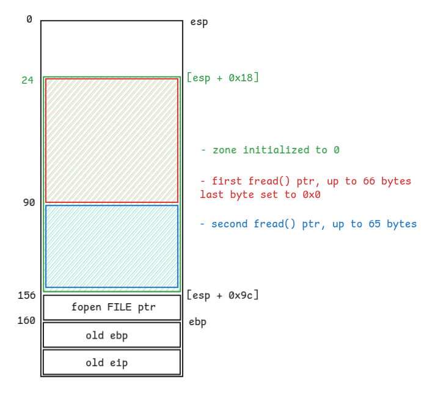

# Bonus3

## Walkthrough

We list the files in the current home directory.

```bash
bonus3@RainFall:~$ ls -la
total 17
dr-xr-x---+ 1 bonus3 bonus3   80 Mar  6  2016 .
dr-x--x--x  1 root   root    340 Sep 23  2015 ..
-rw-r--r--  1 bonus3 bonus3  220 Apr  3  2012 .bash_logout
-rw-r--r--  1 bonus3 bonus3 3530 Sep 23  2015 .bashrc
-rw-r--r--+ 1 bonus3 bonus3   65 Sep 23  2015 .pass
-rw-r--r--  1 bonus3 bonus3  675 Apr  3  2012 .profile
-rwsr-s---+ 1 end    users  5595 Mar  6  2016 bonus3
bonus3@RainFall:~$ file bonus3 
bonus3: setuid setgid ELF 32-bit LSB executable, Intel 80386, version 1 (SYSV), dynamically linked (uses shared libs), for GNU/Linux 2.6.24, BuildID[sha1]=0x530d693450de037e44d1186904401c8f8064874b, not stripped
```

The file is owned by **end** and has the setuid bit.

We list the functions inside the executable.

```
(gdb) info functions
All defined functions:

Non-debugging symbols:
0x0804836c  _init
0x080483b0  strcmp
0x080483b0  strcmp@plt
0x080483c0  fclose
0x080483c0  fclose@plt
0x080483d0  fread
0x080483d0  fread@plt
0x080483e0  puts
0x080483e0  puts@plt
0x080483f0  __gmon_start__
0x080483f0  __gmon_start__@plt
0x08048400  __libc_start_main
0x08048400  __libc_start_main@plt
0x08048410  fopen
0x08048410  fopen@plt
0x08048420  execl
0x08048420  execl@plt
0x08048430  atoi
0x08048430  atoi@plt
0x08048440  _start
0x08048470  __do_global_dtors_aux
0x080484d0  frame_dummy
0x080484f4  main
0x08048620  __libc_csu_init
0x08048690  __libc_csu_fini
0x08048692  __i686.get_pc_thunk.bx
0x080486a0  __do_global_ctors_aux
0x080486cc  _fini
```

There is only 1 user-defined function: `main()`.

```
(gdb) disas main
Dump of assembler code for function main:
   0x080484f4 <+0>:     push   ebp
   0x080484f5 <+1>:     mov    ebp,esp
   0x080484f7 <+3>:     push   edi
   0x080484f8 <+4>:     push   ebx
   0x080484f9 <+5>:     and    esp,0xfffffff0
   0x080484fc <+8>:     sub    esp,0xa0
   0x08048502 <+14>:    mov    edx,0x80486f0
   0x08048507 <+19>:    mov    eax,0x80486f2
   0x0804850c <+24>:    mov    DWORD PTR [esp+0x4],edx
   0x08048510 <+28>:    mov    DWORD PTR [esp],eax
   0x08048513 <+31>:    call   0x8048410 <fopen@plt>
   0x08048518 <+36>:    mov    DWORD PTR [esp+0x9c],eax
   0x0804851f <+43>:    lea    ebx,[esp+0x18]
   0x08048523 <+47>:    mov    eax,0x0
   0x08048528 <+52>:    mov    edx,0x21
   0x0804852d <+57>:    mov    edi,ebx
   0x0804852f <+59>:    mov    ecx,edx
   0x08048531 <+61>:    rep stos DWORD PTR es:[edi],eax
   0x08048533 <+63>:    cmp    DWORD PTR [esp+0x9c],0x0
   0x0804853b <+71>:    je     0x8048543 <main+79>
   0x0804853d <+73>:    cmp    DWORD PTR [ebp+0x8],0x2
   0x08048541 <+77>:    je     0x804854d <main+89>
   0x08048543 <+79>:    mov    eax,0xffffffff
   0x08048548 <+84>:    jmp    0x8048615 <main+289>
   0x0804854d <+89>:    lea    eax,[esp+0x18]
   0x08048551 <+93>:    mov    edx,DWORD PTR [esp+0x9c]
   0x08048558 <+100>:   mov    DWORD PTR [esp+0xc],edx
   0x0804855c <+104>:   mov    DWORD PTR [esp+0x8],0x42
   0x08048564 <+112>:   mov    DWORD PTR [esp+0x4],0x1
   0x0804856c <+120>:   mov    DWORD PTR [esp],eax
   0x0804856f <+123>:   call   0x80483d0 <fread@plt>
   0x08048574 <+128>:   mov    BYTE PTR [esp+0x59],0x0
   0x08048579 <+133>:   mov    eax,DWORD PTR [ebp+0xc]
   0x0804857c <+136>:   add    eax,0x4
   0x0804857f <+139>:   mov    eax,DWORD PTR [eax]
   0x08048581 <+141>:   mov    DWORD PTR [esp],eax
   0x08048584 <+144>:   call   0x8048430 <atoi@plt>
   0x08048589 <+149>:   mov    BYTE PTR [esp+eax*1+0x18],0x0
   0x0804858e <+154>:   lea    eax,[esp+0x18]
   0x08048592 <+158>:   lea    edx,[eax+0x42]
   0x08048595 <+161>:   mov    eax,DWORD PTR [esp+0x9c]
   0x0804859c <+168>:   mov    DWORD PTR [esp+0xc],eax
   0x080485a0 <+172>:   mov    DWORD PTR [esp+0x8],0x41
   0x080485a8 <+180>:   mov    DWORD PTR [esp+0x4],0x1
   0x080485b0 <+188>:   mov    DWORD PTR [esp],edx
   0x080485b3 <+191>:   call   0x80483d0 <fread@plt>
   0x080485b8 <+196>:   mov    eax,DWORD PTR [esp+0x9c]
   0x080485bf <+203>:   mov    DWORD PTR [esp],eax
   0x080485c2 <+206>:   call   0x80483c0 <fclose@plt>
   0x080485c7 <+211>:   mov    eax,DWORD PTR [ebp+0xc]
   0x080485ca <+214>:   add    eax,0x4
   0x080485cd <+217>:   mov    eax,DWORD PTR [eax]
   0x080485cf <+219>:   mov    DWORD PTR [esp+0x4],eax
   0x080485d3 <+223>:   lea    eax,[esp+0x18]
   0x080485d7 <+227>:   mov    DWORD PTR [esp],eax
   0x080485da <+230>:   call   0x80483b0 <strcmp@plt>
   0x080485df <+235>:   test   eax,eax
   0x080485e1 <+237>:   jne    0x8048601 <main+269>
   0x080485e3 <+239>:   mov    DWORD PTR [esp+0x8],0x0
   0x080485eb <+247>:   mov    DWORD PTR [esp+0x4],0x8048707
   0x080485f3 <+255>:   mov    DWORD PTR [esp],0x804870a
   0x080485fa <+262>:   call   0x8048420 <execl@plt>
   0x080485ff <+267>:   jmp    0x8048610 <main+284>
   0x08048601 <+269>:   lea    eax,[esp+0x18]
   0x08048605 <+273>:   add    eax,0x42
   0x08048608 <+276>:   mov    DWORD PTR [esp],eax
   0x0804860b <+279>:   call   0x80483e0 <puts@plt>
   0x08048610 <+284>:   mov    eax,0x0
   0x08048615 <+289>:   lea    esp,[ebp-0x8]
   0x08048618 <+292>:   pop    ebx
   0x08048619 <+293>:   pop    edi
   0x0804861a <+294>:   pop    ebp
   0x0804861b <+295>:   ret
End of assembler dump.
```

The `main()` function:
- calls `fopen()` to open the file `/home/user/end/.pass`
- iterates 33 times from `[esp + 0x18]`, 4 bytes by 4 bytes, to set the bytes to 0
- quits the program if `argc` is not equal to 2
- calls `fread()` to store the content of the previously opened file into `[esp + 0x18]` up to 66 bytes
- sets the `[esp + 0x59]` byte to 0 (the 66th byte previously stored)
- calls `atoi()` to convert `argv[1]` into an `int`, and uses the converted value as an index to set a byte to 0 on the stack
- calls `fread()` to store the remaining content of the opened file into `[esp + 0x18 + 0x42]` up to 65 bytes
- calls `fclose()` to close the file pointer
- calls `strcmp()` to compare `argv[1]` with the stored string in `[esp + 0x18]` and calls `execl()` to execute `/bin/sh` if the return value is 0
- calls `puts()`, if the previous comparison does not return 0, to write the string stored in `[esp + 0x18 + 0x42]`

We draw a diagram of the stack.



From our analysis of the ASM, we figure out that we must succeed in executing the `execl()` in order to complete this level.  
Using the `puts()` function is useless because it reads from the second buffer, which is not gonna contain the start of the password.

The only way to pass the `strmcp()` condition is to compare it with a `\0` character since the function is comparing from `[esp + 0x18]` and `argv[1]` is being used as an index to store 0 somewhere in the stack, from this buffer. If we pass 0 as `argv[1]`, then `[esp + 0x18]` is gonna be equal to 0, but not the value of `argv[1]` because 0 in ASCII is not equal to 0, which means we still won't pass the condition.

We seek some information about `atoi()` on the web and one sentence catches our attention:
> If the first sequence of non-whitespace characters in str is not a valid integral number, or if no such sequence exists because either str is empty or it contains only whitespace characters, no conversion is performed and zero is returned.

If we pass `""` as `argv[1]`, then `atoi()` will convert it to 0, and the empty string will only contain a `\0` character, which is gonna be equal to the 0 byte when comparing strings.

```bash
bonus3@RainFall:~$ ./bonus3 ""
$ whoami
end
$ cat /home/user/end/.pass
3321b6f81659f9a71c76616f606e4b50189cecfea611393d5d649f75e157353c
```

## Resources

- [null in atoi converts the value to 0](https://stackoverflow.com/questions/24862360/null-in-atoi-converts-the-value-to-0)
